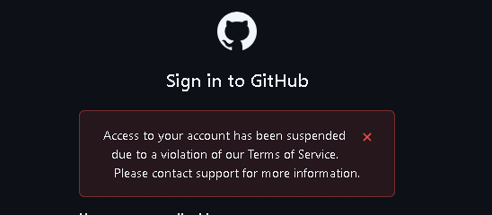

# Olá! 👋 Sou o Eduardo Gelain

**Software & Game Developer | Engenharia Reversa | Modding**

Sou um desenvolvedor apaixonado por destrinchar sistemas, criar soluções e otimizar processos. Minha jornada transita desde a criação de experiências interativas, como jogos em Unity (C#) e Unreal (C++), até a construção de otimizações complexas e engenharia reversa de softwares.

Tenho um carinho especial por explorar ambientes restritos (como o ecossistema UWP/Windows Store), criar ferramentas de injeção nativa e mods para jogos, além de desenvolver aplicações web (React) e utilitários de automação com Python e PowerShell.

> **Fun Fact:** Sabia que este readme inteiro é gerado e atualizado automaticamente via Python consumindo as APIs de onde estão meus projetos? A magia da programação!! 🪄
> [Veja o código do agregador aqui](https://github.com/Spet001/Spet001/blob/main/update_profile.py)

### 🛠️ Tech Stack & Ferramentas

---

### 🚀 Meus Projetos e Mods

A maioria do meu código fonte e meus mods estão hospedados em plataformas mais especializadas. Abaixo você encontra a lista atualizada automaticamente dos meus projetos mais recentes no GitLab, Nexus Mods e itch.io:

<!-- START_PROJETOS -->
### 🦊 GitLab
- 🦊 [**CW-UWP-GSC-Injector**](https://gitlab.com/Spet001/CW-UWP-GSC-Injector)  - A lightweight, zero-dependency, standalone C++ console utility that injects compiled GSC scripts into the Microsoft Store/Xbox App version of Call of Duty: Black Ops Cold War (T9).
- 🦊 [**ZPGDK**](https://gitlab.com/Spet001/msclients)    - Clients for MS Store CODs
- 🦊 [**ResurgeGDK**](https://gitlab.com/Spet001/resurgegdkbackup)    - Resurge Client: Play Black Ops 3 on XBOX PC Servers.

### 🎮 itch.io
- 🎮 [**Grid-Based First-Person Movement Template - Unreal 5**](https://spet01.itch.io/grid-based-first-person-movement-template-unreal-5) - Foundation for creating grid-based, first-person dungeon crawler games in Unreal Engine 5.
- 🎮 [**Outcaster - A 2.5D FPS Template**](https://spet01.itch.io/outcaster-retro-fps-template) - Outcaster (Template Version) is a  FPS template for Unity 6.
- 🎮 [**Outcaster - a 3D FPS Template**](https://spet01.itch.io/outcaster-a-3d-fps-template) - A simple Unity 6 3D FPS Template.

### ⚔️ Nexus Mods
- ⚔️ [**FF13 Fix for Microsoft Store-Xbox Gamepass**](https://www.nexusmods.com/finalfantasy13/mods/59) - **FF13Fix** is a set of performance and bug fixes for the *Final Fantasy XIII* version available on the Microsoft Store (Xbox Game Pass for PC). This project adapts the fixes from the [original FF13Fix](https://github.com/rebtd7/FF13Fix) to make them compatible with this specific version of the game. *(↓ 898 Downloads)*
- ⚔️ [**Pirate Yakuza- MS Store Mod Installer**](https://www.nexusmods.com/likeadragonpirateyakuzainhawaii/mods/181) - This tool provides a workaround for installing mods in certain Yakuza games purchased from the Microsoft Store or played via Xbox Game Pass, where the Shin Ryu Mod Manager is not functional. This is the only known method to get mods working for games like Yakuza Kiwami 2 and Like a Dragon Pirate Yakuza. *(↓ 214 Downloads)*

<!-- END_PROJETOS -->

---

### 📬 Como me encontrar
- **GitLab:** [@Spet001](https://gitlab.com/Spet001)
- **itch.io:** [spet01.itch.io](https://spet01.itch.io/)
- **Nexus Mods:** [Spet001](https://www.nexusmods.com/profile/Spet001/mods)
- **LinkedIn:** [Eduardo Gelain](https://www.linkedin.com/in/eduardo-gelain/)

---

### Trivia
*I used to be an adventurer like you, then I took a...*

 
*...in the knee.*
